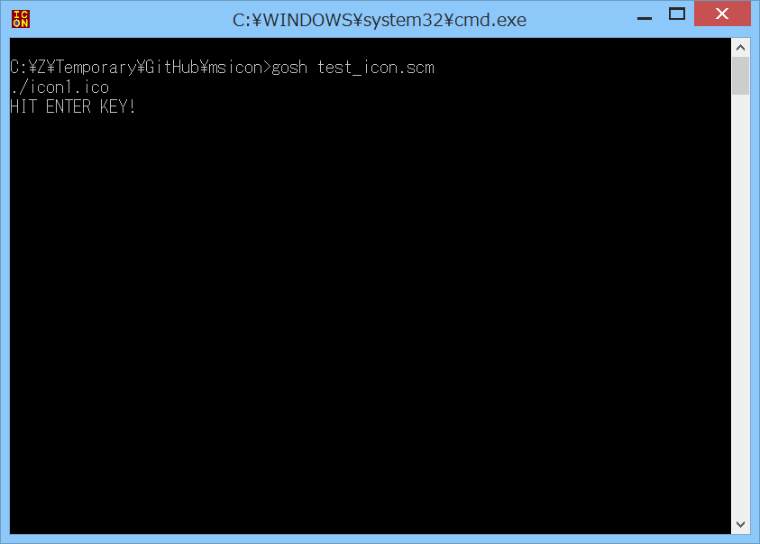

# msicon



## 概要
- Gauche の Windows 版で、ウィンドウの左上に表示されるアイコンを設定するための  
  モジュールです。


## インストール方法
1. 事前準備  
   事前に、Gauche および開発環境がインストールされている必要があります。  
   Gauche については、以下のページに Windows用バイナリインストーラ があるので、インストールを実施ください。  
   http://practical-scheme.net/gauche/download-j.html  
   (すでにインストール済みであれば本手順は不要です)  
   
   また、開発環境については、MSYS2/MinGW-w64 (64bit/32bit) の開発環境が必要です。  
   以下のページを参考に インストールを実施ください。  
   https://gist.github.com/Hamayama/eb4b4824ada3ac71beee0c9bb5fa546d  
   (すでにインストール済みであれば本手順は不要です)  
   
   (注意) 32bitと64bitの成果物の混在には注意してください。  
   (例えば、32bit版の Gauche から、64bitのライブラリを呼び出すと、エラーになります)

2. ファイルのダウンロード  
   本サイト ( https://github.com/Hamayama/msicon ) のソースを、  
   (Download Zip ボタン等で) ダウンロードして、作業用のフォルダに展開してください。  
   例えば、作業用のフォルダを c:\work とすると、  
   c:\work\msicon の下にファイル一式が配置されるように展開してください。  
   (注意) 作業用フォルダのパスには、空白を入れないようにしてください。

3. コンパイルとインストール  
   ＜MSYS2/MinGW-w64 (64bit) 環境の場合＞  
   プログラムメニューから MSYS2 の MinGW 64bit Shell を起動して、以下のコマンドを実行してください。  
   ＜MSYS2/MinGW-w64 (32bit) 環境の場合＞  
   プログラムメニューから MSYS2 の MinGW 32bit Shell を起動して、以下のコマンドを実行してください。  
   ( c:\work にソースを展開した場合)
   ```
     cd /c/work/msicon
     ./configure   # Makefile等を生成します
     make          # コンパイルを実行します
     make install  # Gaucheのライブラリフォルダにインストールします
     make check    # テストを実行します
   ```
   (注意) 環境によっては make install を実行すると、  
   「*** ERROR: mkstemp failed」というエラーが発生します。  
   このエラーは c:\Program Files (x86) のフォルダに 書き込み権限がないとき等に発生します。  
   その場合には、プログラムメニューからの開発環境の起動時に右クリックして、  
   「管理者として実行」を選択してください。  
   そして再度上記のコマンドを実行してください。

- 以上です。


## 使い方
```
  (use msicon) ; モジュールをロードします。
  (set-window-icon #f "title" "icon1.ico")
               ; ウィンドウにアイコンファイルを設定します。
               ; 第1引数にはウィンドウのクラス名を指定します。#fだと未指定になります。
               ; 第2引数にはウィンドウのタイトル名を指定します。#fだと未指定になります。
               ; 第3引数にはアイコンファイルのパス名を指定します。
```


## 注意事項
1. アイコンファイルは、ico ファイルフォーマットである必要があります。  
   (bmp, gif, png, jpeg ファイルフォーマット等には 非対応です)  
   また、リソースファイルに埋め込んだアイコンについては 非対応です。

2. 本モジュールは、Windows API の FindWindow を使用して、ウィンドウを検索しています。  
   set-window-icon の第1引数と第2引数は、この API の引数になります。  
   また、この API の制約のため、うまく検索できないケースがあります。

3. タスクバーに表示されるアイコンについては、変更されないケースがあります。


## 環境等
- OS
  - Windows 8.1 (64bit)
- 環境
  - MSYS2/MinGW-w64 (64bit/32bit) (gcc version 7.3.0 (Rev2, Built by MSYS2 project))
  - MinGW (32bit) (gcc version 6.3.0 (MinGW.org GCC-6.3.0-1))
- 言語
  - Gauche v0.9.6
  - Gauche v0.9.5
  - Gauche v0.9.4

## 履歴
- 2016-4-16  v1.00 (初版)
- 2016-4-16  v1.01 デバッグ用処理一部修正
- 2016-4-22  v1.02 tchar.h のインクルードを追加
- 2016-10-14 v1.02 README修正のみ(Gauche v0.9.5 で動作確認)
- 2016-10-14 v1.03 ファイルの文字コード修正(SJIS→UTF-8)
- 2018-7-9   v1.03 README修正のみ(Gauche v0.9.6 で動作確認)


(2018-7-9)
